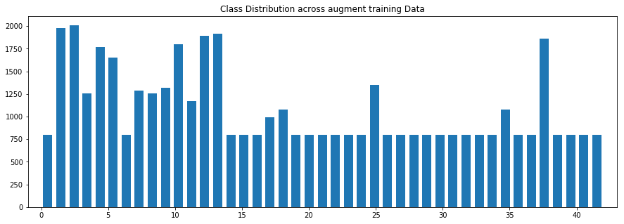
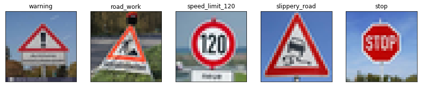

# **Traffic Sign Recognition** 

## Overview
In this project, you will use what you've learned about deep neural networks and convolutional neural networks to classify traffic signs. You will train a model so it can decode traffic signs from natural images by using the **German Traffic Sign Dataset**. After the model is trained, you will then test your model program on new images of traffic signs you find on the web, or, if you're feeling adventurous pictures of traffic signs you find locally.

**The goals / steps of this project are the following:**
* Load the data set 
* Explore, summarize and visualize the data set
* Design, train and test a model architecture
* Use the model to make predictions on new images
* Analyze the softmax probabilities of the new images

### 1. Load the data set

* Number of training examples = 34799
* Number of validation examples = 4410
* Number of testing examples = 12630
* Image data shape = (32, 32)
* Number of classes = 43

### 2. Explore, summarize and visualize the data set

* Randomly choose six images from training set and display them, along with their labels


* Display histogram to show class/label distribution across training data


* Remark:

    We can see both the training and test data are skewed. The only difference is the number of counts for each class. If we wanted to maximize the accuracy on the test set, it does not make sense to balance the class distribution on the training set, since the test set is skewed in the same way the training set is skewed. We need to augment data generating.

### 3. Design, train and test a model architecture


#### 3-1. Pre-process the Data Set

* Normalization (mean=0, sigma=1)
* Grayscale images
* Data augmentation



* Remark : 
    
    Data augmentation is the single best method to increase accuracy of the model. Because several classes in the data have far fewer samples than others the model will tend to be biased toward those classes with more samples. I implemented augmentation by creating copies of each sample for a class (sometimes several copies) in order to boost the number of samples for the class to 800 (if that class didn't already have at least 800 samples). Each copy is fed into a "jitter" pipeline that randomly translates, scales, warps, and brightness adjusts the image. I sought to keep the parameters for these transformations relatively conservative and keep the sign in the image recognizable. This was by far the most laborious part of the project, and it takes quite some time to run the code.


#### 3-2 Model Architecture (Modified LeNet)
    adapted from Sermanet/LeCunn traffic sign classification journal article


* Modified LeNet Model Architecture.


| Layer         		|     Description	        					| 
|:---------------------:|:---------------------------------------------:| 
| Input         		| 32x32x3 RGB image   							| 
| Convolution 5x5     	| 1x1 stride, same padding, outputs 28x28x6 	|
| RELU					|												|
| Max pooling	      	| 2x2 stride,  outputs 14x14x6 				|
| Convolution 5x5	    | 1x1 stride, same padding, outputs 10x10x16      									|
| RELU					|												|
| Max pooling	      	| 2x2 stride,  outputs 5x5x16 				|
| Convolution 5x5	    | 1x1 stride, same padding, outputs 1x1x400      									|
| RELU					|												|
| Flatten layers  |8 (1x1x400 -> 400) and 6 (5x5x16 -> 400)												|
| Concatenate flattened layers  |to a single size-800 layer
Dropout layer	|
| Fully connected		| 800 in, 43 out				|

 
#### 3-3 Train, Validate and Test the Model

* A validation set can be used to assess how well the model is performing. A low accuracy on the training and validation
sets imply underfitting. A high accuracy on the training set but low accuracy on the validation set implies overfitting.

* I used the Adam optimizer (already implemented in the LeNet lab). The final settings used were:

    1. batch size: 100
    2. epochs: 60
    3. learning rate: 0.0009
    4. mu: 0
    5. sigma: 0.1
    6. dropout keep probability: 0.5

* Train accuracy
    * Epoch 1 -- Train acc.: 0.9025, Validation acc.: 0.8515, Elapsed time: 4.13 sec
    * Epoch 10 -- Train acc.: 0.9983, Validation acc.: 0.9420, Elapsed time: 35.08 sec
    * Epoch 20 -- Train acc.: 0.9997, Validation acc.: 0.9605, Elapsed time: 40.48 sec
    * Epoch 30 -- Train acc.: 0.9998, Validation acc.: 0.9603, Elapsed time: 38.94 sec
    * Epoch 40 -- Train acc.: 1.0000, Validation acc.: 0.9578, Elapsed time: 38.94 sec
    * Epoch 50 -- Train acc.: 1.0000, Validation acc.: 0.9603, Elapsed time: 39.49 sec
    * Epoch 60 -- Train acc.: 1.0000, Validation acc.: 0.9615, Elapsed time: 39.00 sec

*  After all, the test set accuracy is **95%**

### 4. Use the model to make predictions on new images

* download at least five pictures of German traffic signs from the web and use your model to predict the traffic sign type.

* Predict the Sign Type for Each Image



    File name: warning                   Predicted name: Roundabout mandatory
    File name: road_work                 Predicted name: Double curve
    File name: speed_limit_120           Predicted name: Speed limit (120km/h)
    File name: slippery_road             Predicted name: Slippery road
    File name: stop                      Predicted name: Stop
    
    The accuracy for these 5 new images: 0.60 (60%)

### 5. Analyze the softmax probabilities of the new images

* For each of the new images, print out the model's softmax probabilities to show the **certainty** of the model's predictions with [`tf.nn.top_k`](https://www.tensorflow.org/versions/r0.12/api_docs/python/nn.html#top_k)
```python
softmax_logits = tf.nn.softmax(logits)
top_k = tf.nn.top_k(softmax_logits, k=3)

with tf.Session() as sess:
    saver3 = tf.train.import_meta_graph('./lenet.meta')
    saver3.restore(sess, "./lenet")

    my_softmax_logits = sess.run(softmax_logits, feed_dict={x: X_img_test, keep_prob: 1.0})
    my_top_k = sess.run(top_k, feed_dict={x: X_img_test, keep_prob: 1.})
```

    
    The accuracy with softmax probability is still for these 5 new images: 0.60 (60%)

### 6. The end
In this project, I am able to use what I've learned about deep neural networks and convolutional neural networks with tensorflow to classify traffic signs. After that, I hope to learn a lot and move forward to be an export of data science
